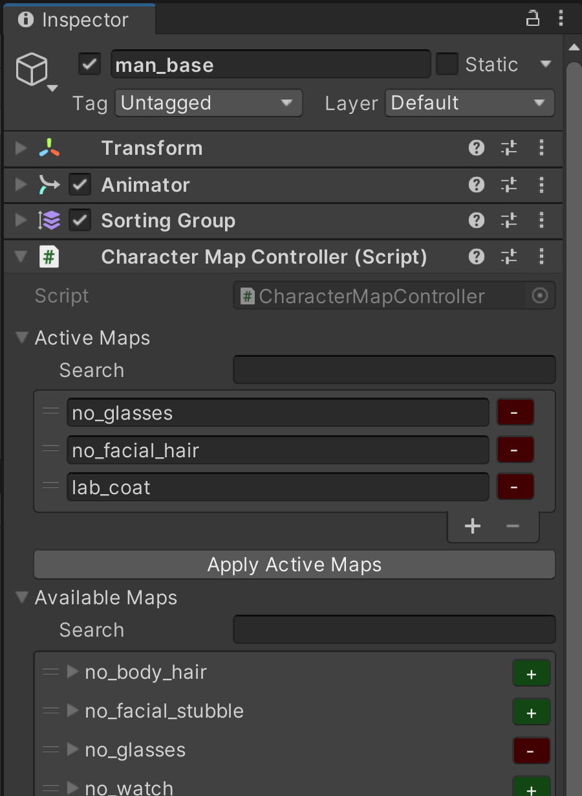
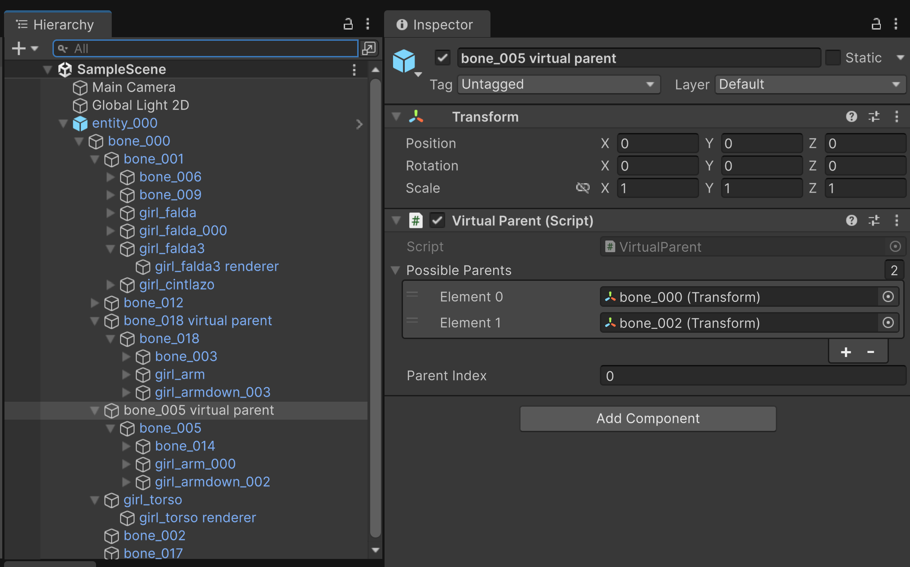
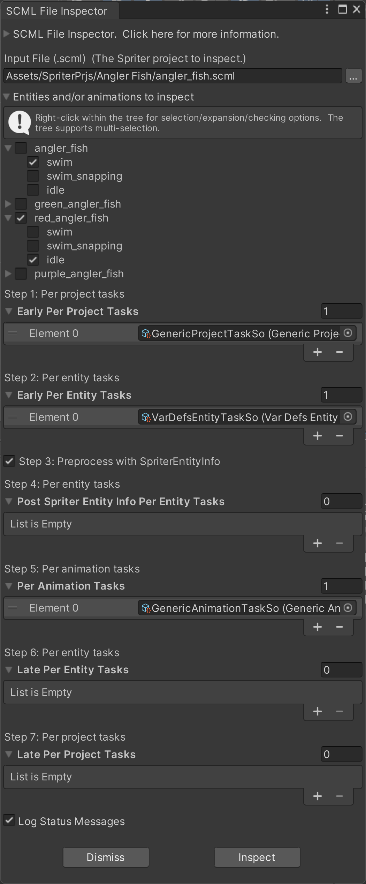

# Spriter to Unity Importer (STUI)

A powerful Unity asset for converting your Spriter projects into native Unity prefabs, animator controllers, and animation clips.

# Description
The ***Spriter to Unity Importer***, henceforth referred to as `Stui` (pronounced the same as `Stewie`), helps you integrate Spriter projects into Unity.  It imports Spriter `.scml` files and the images that it references and produces the following as output:

* **Prefabs**  
One prefab will be generated for each of the entities in the `.scml` file.  The prefab's preview image will be generated based on the first frame of the entity's first animation.
* **Animator controllers**  
One animator controller will be generated for each of the entities.  An animation state will be created for each of the entity's animations.
* **Animation clips**  
One animation clip will be generated for each of an entity's animations.  These are standard Unity animation clips that can be played/scrubbed in-editor using Unity's Animator window.  If the structure of the Spriter file permits it, you can use Unity animation features such as crossfade, transition blending, blend trees, and animation layers.

# Where to Get Stui and How to Install it

You have two simple options for installation: grab the UnityPackage from Releases, or install directly from source.

1. **Install via Unity Package** 
    1. Grab the latest Unity package from [here.](https://github.com/TerminalJack/stui/releases) Unlike the Github repo (which is a complete Unity project), the Unity package will have only the files you need for integration into your own Unity project. 
    2. Drag-and-drop the package into your project's `Project` window. 
    3. In the import dialog, click `Import`.
2. **Install from Source** 
    1. Clone or download the full repo: 
    `git clone https://github.com/TerminalJack/stui.git` 
    2. In your OS file browser, locate the `Stui/` folder (the one found in the `Assets/` folder) inside the repo. 
    3. Drag-and-drop that folder into your Unity `Project` window.

> The default installation location is `Assets/Stui/` but you can rename the folder and/or move it into another folder such as `Assets/Plugins/` or `Assets/3rdParty/`.

This asset uses assembly definition (`asmdef`) files, which keep the Stui asset files separate from your project.  This prevents Unity from recompiling the Stui code each time your project compiles.  If _your_ project uses `asmdef` files as well then see the section [Assembly Definitions](#assembly-definitions) for instructions on how to add references to the Stui assemblies to your project.  If your project doesn't use `asmdef` files then there is nothing you will need to do to make use of Stui's assemblies.  Unity will handle them automatically.

# Quick Start!

Once Stui is installed you can import a Spriter project simply by dropping the folder that contains the `.scml` file--**and** all of the image files needed by the `.scml` file--into the Unity `Project` window.

Dropping a Spriter project folder into Unity's `Project` window will kick-off Unity's importers (for the image files) and, once Unity is done, it will hand control to Stui to import the `.scml` file.  A window with a few import options will pop-up at this time.  For now, simply leave the import options as-is and click the `Import` button.

This will import all of the contents from all of the `.scml` files that are found in the folder and its subfolders.  The importer will ignore Spriter's `.autosave.scml` files so don't worry about them being present during import.

The importer will write its generated output files (the prefabs, etc.) into the same folder as the corresponding `.scml` file.  Depending on import settings, animation clips can be embedded in the prefab or written into a subfolder.

The `Spriter Import Status` window will keep you informed about the import progress.  The information in this window isn't particularly important so don't try to keep up with it as it scrolls by.  It basically serves to let you know that the importer is, in fact, doing its job.  Any important information will be logged to the console.

You may notice that the imported prefabs pop-up in the scene view during processing.  This is normal and they will be removed once they are imported.  Sometimes the sprites will be all jumbled-up but that's normal as well.

Once the import is complete, check the folder for newly created prefab files.  There will be one for each entity in the `.scml` file(s).  If you click on one of these prefabs you will see that its preview image is generated from the first frame of the entity's first animation.

> If the preview image is completely dark then you are likely using URP with lit materials as the default material type.  Unity, for whatever reason, doesn't use any lighting in the preview window and it doesn't give you an option to do so.

Drop one of these prefabs into the `Scene` view.  Open Unity's `Animation` window.  Select the game object (the instantiated prefab) in the `Scene` view and select an animation clip in the `Animation` window.  Hit the play animation button (▶️) and the animation will play.

>This assumes that that particular clip actually had an animation.  Creators wll often use one or more Spriter animations as a static guideline or template, from which they base their actual animations off of.  If the clip doesn't actually animate anything then try another one.

A quick and easy way to play through all of a prefab's animation clips is to use the `Clip Runner` component.  You'll find this component in the `Extras/` folder.  Put a `Clip Runner` component on the root of the game object.  (Where the `Animator` component is located.)

Leave the properties as-is and run the scene.  (Leave the `Cross Fade` property unchecked, in particular.)  This will run each of the animation clips in the game view.

Assuming that all has gone well, you are ready to use the generated prefabs, animation clips, etc. in your next masterpiece.

If you need to reimport a `.scml` file at any time, right-click the file and click `Reimport`.  This will attempt to integrate any changes that have been made to the `.scml` file into the existing prefabs and animator controllers.  The reimport will overwrite the animation clips but it will attempt to preserve any animation events that you have added.

If there have been drastic changes to the `.scml` file since the prefab was last generated then reimporting over an existing prefab may seemingly corrupt the prefab.  At this point, the importer isn't particularly robust in this regard.  See the `Tips and Tricks` section on how to avoid (or at least minimize) putting any customizations in the hierarchy of the prefab.  If you do this then you can simply delete the prefab before reimporting to ensure that there are no issues with reimporting on top of a preexisting prefab.

Finally, before you go and play with the newly generated prefabs, be wary when trying to use Unity's transition blending feature.  When you create a transition from one animator state to another, Unity will, by default, blend the two animations.

For Spriter projects, the biggest factor as to whether this works or not depends on how different the bone hierarchy is between the two animations.  If they are different in any way then you will likely have sprites that go flying off in seemingly random directions during the transition.  This applies when using the `Animator.CrossFade()` method as well.  If you run into this issue then you will either need to change the bone hierarchy in Spriter or completely disable transition blending for the affected animator states.

# Supported Spriter features.

The importer currently supports the following Spriter features:

* **All Spriter easing curve types.**  Instant (aka constant), linear, quadratic, cubic, quartic, quintic, and Bézier curves are all converted to Unity animation curves with high visual fidelity.
* **Dynamic reparenting.**  Spriter allows the artist to reassign a bone/sprite's parent at any time of an animation.  The importer will emulate this functionality by creating a `virtual parent` for the bones and sprites that have more than one parent (across all of the entity's animations.)  This is also known as a `parent constraint` or `child of constraint` in animation applications.
* **Non-default / dynamic pivots.**  Spriter allows a sprite's pivot to change at any time of an animation.  The importer fully supports this via a `dynamic pivot` component.
* **Sort order or z-index.**  Sprites can change their sort order frame-by-frame.  This is fully supported via the `Sprite Renderer` `Order in layer` property.
* **Character maps.**  Character maps are a powerful feature that allow you to easily customize the appearance of imported Spriter entities.  This is basically a re-skinning feature.
* **Action points.**  Spriter action points will be imported as transforms.  They can be moved, rotated, and reparented.  They are useful for specifying "spawn points" (the location and rotation) of game objects, such as projectiles.
* **Sounds effects.**  Spriter allows for sounds effects (`.wav` files) to play at specific points during an animation.  The importer will create animation events for each of the sound effects and there is a component provided (`Sound Controller`) that will handle the details of playing the sounds.  Note that sound effects will play only when your game is in play mode.  The sound effects will not play in-editor due to limitations in Unity.  Stay tuned for more information regarding this feature.
* **Event triggers.**  Events are user-defined actions (that is, your code) that run at a specific point in time during an animation.  These are imported as Unity animation events.  You can subscribe to these events either at design time via the inspector and/or you can subscribe to them at runtime via an API.  Stay tuned for more information regarding this feature.
* **Variables.**  Spriter allows the animator to create animation curves for arbitrary, non-visual data.  These animation curves can then be used at runtime by the game designer for information that needs to be in-sync with the animations.  All of Spriter's variable types are supported by Stui: `float`s, `int`s and `string`s.  Stay tuned for more information regarding this feature.
* **Tags.** Spriter tags are a simple way of indicating that the entity is, or is not, in a particular state.  Spriter allows you to define as many tags as you need.  A tag is either active or not and this can be determined at runtime by the game designer.  Stay tuned for more information regarding this feature.
* **Bone alpha.**  Spriter allows a *bone's* transparency (aka alpha) to be animated (or just have a value other than 1.)  This affects the sprites that are children of the bone.  In practice, it doesn't look very good due to all of the overlapping sprites but the feature is supported by the importer should you need it.
* **Animated bone scales.**  Spriter and Unity handle bone scales differently.  The importer has an option to support this feature.  In the cases where a Spriter project uses this feature, enabling the option at the time of import will help ensure that Unity's playback matches that of Spriter.  If the option is disabled then bone scales will be baked-in for each keyframe.  This is more performant but could result in Unity animations that do not entirely match Spriter's animations.
* **Collision rectangles.**  Spriter allows the animator to create box colliders that can be animated similar to how an image is animated.  When imported, these will be converted to a game object that has both a `BoxCollider2D` and a `Rigidbody2D` Unity component.  Stui will also place a `Collision Rectangle` component on the game object.  Animation curves will move, scale, and enable or disable the collider.  The `Collision Rectangle` component's inspector allows for design-time subscription to the various collision events.  (`OnEnter`, `OnStay`, and `OnExit`.)  An API is also provided for runtime subscription to these events.  Stay tuned for more information regarding this feature.

# Unsupported Spriter Features.

The following Spriter features are not supported and will likely not be supported in the future:

* **SCON files.**  SCON files are an alternative to SCML files.  Stui works only with SCML files.  Spriter can easily convert a SCON file into a SCML file with its **File** | **Save As** feature.
* **Sub-entities.**  Basically animations within animations.
* **Texture Packer atlases.**  Stui works great with Unity's sprite atlases.  You are encouraged to use them instead.
* **Pixel art Spriter projects.**  Spriter supports a special mode for pixel art.  The importer doesn't support these types of Spriter projects.

# Supported Versions of Unity.

The importer and the generated prefabs, animator controllers, animation clips, and the runtime library are all supported by Unity version 2019 and later.  The importer's output is **not** tied to the same version of Unity that produced it.  That is, you can produce the prefabs, animator controllers, and animation clips in Unity 2019 and use them as-is in Unity version 6.1 and vice-versa.

# Supported Pipelines.

The importer and its output will work with the built-in renderer (aka BiRP) as well as the Universal Render Pipeline (URP.)

# Supported Development Platforms.

As of this writing the only development platform that has been tested is Windows.  If you try the importer on another development platform then please let me know how it goes!

# Supported Runtime Platforms.

The following runtime platforms have been tested at this time:

* Windows
* WebGL
* Android

Please let me know how it goes for the other runtime platforms.

# Import Options.

The `Spriter Import Options` window will appear whenever you either, a) drop a Spriter project into Unity's `Project` window, or, b) right-click an `.scml` file and select `Reimport`.

You'll be given the option to set the options shown in the figure below.

Once you have selected the appropriate options, click the `Import` button to proceed with the import.  Click `Cancel` to dismiss the window and cancel the import.

Unless you have a specific need to change the `Pixels Per Unit` value, it is best to leave it as-is with its default value of 100.

The `Direct Sprite Swapping` checkbox should be disabled if you intend to a) use texture controllers and/or b) create character maps.  See the description for the `Texture Controller` component for more information.

If your Spriter project has any entities that define Character Maps then enabling `Create Character Maps` will add a `Character Map Controller` component to the root of those prefabs.

The `Animate Bone Scales` option, when checked, will ensure that Spriter animations that use this feature look as similar as possible when played back in Unity.  There is a trade-off, however, in terms of both performance and resources.  Additional components and animation curves are required to support this feature.

If the `Animate Bone Scales` option is checked but not needed then the additional components and animation curves will *not* be created and there will not be any performance penalty.  If this option is disabled and there are one or more animations that use bone scaling then the scales will be baked-in for each keyframe and there will be no tweening of the bone scales for the affected keys.  Many times this is sufficient but be sure to examine the output closely in this case.

The `Animation Import Style` dropdown has the two options: `Nested In Prefab` and `Separate Folder`.  If you select `Separate Folder`, a prefab's animation clips will be placed in a subfolder named "{*prefabName*}_Anims".

# Runtime Components.

The following components are used at runtime (and in some cases, in-editor) to supplement the animations and visuals generated by the importer.  The components will be found in the prefab's hierarchy when and where they are needed.

## `Character Map Controller`

>Whether `Character Map Controllers` are created, or not, is determined at the time of import.  Uncheck the `Direct Sprite Swapping` checkbox *and* check the `Create Character Maps` checkbox to create a `Character Map Controller` component for each of the Spriter entities that have one or more character maps defined.

The `Character Map Controller` inspector, seen above, can be used to apply design-time character map changes to a prefab or a prefab instance.

The `Active Maps` property shows which maps are currently active.  You can change the order of the maps via drag-and-drop.  Use the drag handle at the left of the item for this.  The order that the maps are applied is from the top-most map downward.  Many times the order is important so if you don't see the result you think you should then try reordering the items.

You can remove a map by clicking the `-` button on the right or by selecting it and clicking `-` at the bottom of the list.  Clicking `+` at the bottom of the list will allow you to add a new map manually.  An easier way to add and remove maps is via the `Available Maps` property.

Expand the `Available Maps` property to see all of the maps that have been defined for the entity.  Click the `+` button to the right of a map name to add it to `Active Maps`.  If the map is already active then a `-` button will be available.  Clicking it will remove the map from `Active Maps`.

If you feel that the list of items shown in `Active Maps` is not up to date then clicking the `Apply Active Maps` button can be used to ensure that they are.  This will also validate all of the map names in `Active Maps`.  (Check the console.)

Both the `Active Maps` list and the `Available Maps` list have a search feature.  This will filter the lists based on a search string, which can be handy for large lists.

## Character Map Controller API
---
To make character map changes at runtime, use the `Character Map Controller` API.

## Properties

### `public List<string> ActiveMapNames`

`ActiveMapNames` holds the names of each of the active maps.  You can modify this list directly or use the convenience methods `Clear()`, `Add()`, and `Remove()`.  If you need to make a lot of changes at once then modifying the list directly will be more performant.  If you do modify the list directly then be sure to call `Refresh()` afterward to apply your changes.

### `public List<CharacterMapping> AvailableMaps`

This list contains all of the maps that are defined for this prefab.  These are determined by the corresponding Spriter entity.  If you need to make changes to this list then you are strongly encouraged to make them to the original Spriter file since any changes you make will be lost when/if you do a reimport.

### `public CharacterMapping BaseMap`

This is a map that defines the prefab's default sprite mapping.  This is used as the base for all other maps.  It is applied before any other maps are applied.  You are advised to leave this as-is.  Any changes will likely break future reimports.

## Methods

### `void Clear()`

Removes all map names from the `ActiveMapNames` list and applies the change via `Refresh()`.  This will reset all of the sprites to the mapping defined in the `BaseMap` property.

---

### `bool Add(string mapName)`

Adds the map, `mapName`, to the end of the `ActiveMapNames` list and applies the change via `Refresh()`.  If `mapName` was already in the list then it will be removed from its current position and added to the end.

**Returns**

Returns `true` if successful.  Returns `false` if `mapName` is not a valid map name.  That is, it wasn't found in the `AvailableMaps` list.

---

### `bool Remove(string mapName)`

Removes the map, `mapName`, from the `ActiveMapNames` list and applies the change via `Refresh()`.

**Returns**

Returns `true` if `mapName` was successfully removed.  Returns `false` if `mapName` wasn't found in the `ActiveMapNames` list.

---

### `void Refresh(bool logWarnings = true)`

Applies all of the maps in the `ActiveMapNames` list.  The mapping defined in `BaseMap` is applied first then each of the mappings in `ActiveMapNames` are applied.  If any map names in `ActiveMapNames` is invalid *and* `logWarnings` is `true`, then a warning will be logged to the console.

## `Dynamic Pivot 2D`

A Dynamic Pivot 2D component will be used in the case where--if in any of an entity's animations--a sprite uses a pivot point that is different than its default.  The entity's animation clips will then have animation curves that set the pivot's `X` and `Y` properties as appropriate.

When a Dynamic Pivot 2D component is used the sprite renderer will be placed on a child transform and the pivot component will adjust the child transform's position to take the pivot point into account.  The animation curves that move, rotate, and scale the sprite will be done to the transform containing the pivot component and not the transform containing the sprite renderer, as is done normally.

## `Texture Controller`

>Whether `Texture Controllers` are created, or not, is determined at the time of import.  Uncheck the `Direct Sprite Swapping` checkbox to create texture controllers.

When a sprite has more than one texture (across all animations) a `Texture Controller` component can be used as a kind of proxy that sits between the animation clips and the sprite renderer.  This comes in handy for when you want to do things such as 're-skin' your character or have different textures based on a status such as heath.

When a sprite has more than one texture, *without* the texture controller component, animation clips will overwrite a sprite's texture with whatever is specified in the animation clip.  This is due to the fact that the clips animate the `SpriteRenderer.Sprite` property directly.

*With* the texture controller component, animation clips will (indirectly) select the sprite renderer's texture based on the `Displayed Sprite` property, which is an index into the `Sprites` array.  You can then place your re-skinned textures into the `Sprites` array and not have to worry about the animation clips overwriting your customizations.

Sprites that have only a single texture across all animations will not have a `Texture Controller` component.  In this case, `SpriteRenderer.Sprite` isn't being animated so you can simply put your custom texture directly into it.

>See the Character Map feature as well for a powerful way of re-skinning your imported Spriter entities.  The `Character Map Controller` component works with `Texture Controller` components to support Spriter's Character Map feature.

## `Virtual Parent`

If you're familiar with Parent Constraints or Child-of Constraints then you will already understand the purpose of the `Virtual Parent` component.

When a transform has a virtual parent component, the component will make children of that transform behave as though they are children of a parent other than their actual parent.  This is how the importer deals with the fact that Spriter allows the creator to re-parent bones and sprites at any time during an animation.

Unity animation clips require the paths to properties that it animates remain static.  For this reason, you can't move a game object/transform around in the hierarchy when it has properties that are being animated.  That is, you can't actually re-parent transforms via animation.

Bones and sprites that have more than one parent (across all animations) will have a `Virtual Parent` component created to deal with switching between parents during animations.  The importer will populate the `Possible Parents` array and animation clips will select the appropriate parent via the `Parent Index` property.

If any `Virtual Parent` components (or `Spatial Adapter` components) are created during an import then a `Dependency Resolver` component will be created and placed at the root of the prefab.  A `Dependency Resolver` will coordinate the ordered execution of virtual parents and spatial adapters and is required for them to function properly.

>Unity has a `Parent Constraint` component but it isn't used due to the fact that it doesn't work in-editor when playing/scrubbing animation clips.

See the **Tips and tricks** section for some other handy uses for the `Virtual Parent` component.

# The Prefab's Bind Pose

The **bind pose** (also called the rest pose or default pose) is the reference state of a prefab before any animation is applied. It’s defined by the first frame of the entity’s first animation and also determines the prefab’s preview image.

If a prefab has many virtual parents then some thought should be given to which animation is used to define the bind pose.  Ideally, you want to use a bind pose that will exploit a particular optimization in the `Virtual Parent` component.

## What the Bind Pose Includes

- Transform properties
  - Position, rotation, scale
- Rendering properties
  - Sprite image, sorting order, visibility, alpha
- Constraint properties
  - Virtual parent assignments, pivot points

## How Unity, the Importer, and Spriter Use the Bind Pose

- When you drop a prefab into the Scene view, it appears in its bind pose.
- Spriter doesn't have the concept of a bind pose but, so far as the importer is concerned, in the Spriter application, dragging an animation into the top-most row makes that animation's first frame the bind pose.
- During import, the importer compares each animatable property against its bind-pose value. If a property never deviates then the importer skips generating an animation curve for it. At runtime, channels without curves automatically fall back to their bind pose values, reducing clip size, memory usage, and sampling overhead.

## Virtual Parent Optimization

During import, each `Virtual Parent` component is configured so that its "actual parent" in the hierarchy matches the parent defined in the first frame of the entity's first animation.

- If `Parent Index == 0` (virtual parent equals actual parent), the component simply resets its transform.
- This reset code path skips constraint solving entirely, offering a significant performance boost over full constraint evaluation.

## Choosing the Best Bind Pose

1. Identify the pose most representative of your common animations.
2. Ensure virtual parents in that pose line up with their actual parents to trigger the reset-only code path.
3. (Optional) Apply the same principle to pivot points when they’re in use.

By selecting a bind pose that matches your typical animation scenarios, you maximize the use of these optimizations.

# Assembly Definitions

This package includes two assemblies:

- **`TerminalJack.Stui`** — runtime code
- **`TerminalJack.Stui.Editor`** — editor‑only tools (custom inspectors, windows, utilities)

Unity enforces strict separation between runtime and editor assemblies. Runtime code cannot reference editor code. Editor code *can* reference runtime code.

---

## **If your project uses asmdefs**

If your project defines its own assembly definitions, you must add references to the appropriate STUI assemblies.

## **Runtime scripts**
If you have a runtime asmdef (e.g., `MyGame.Runtime.asmdef`):

- Add a reference to:
  **`TerminalJack.Stui`**

This enables your scripts to use STUI’s runtime API.

## **Editor scripts**
If you have an editor asmdef (e.g., `MyGame.Editor.asmdef`):

- Add references to:
  - **`TerminalJack.Stui`**
  - **`TerminalJack.Stui.Editor`**

This enables custom inspectors, property drawers, and other editor extensions.

## **Important**
Do **not** reference `TerminalJack.Stui.Editor` from a runtime asmdef.  Doing so will prevent your project from building.

---

## **If your project does *not* use asmdefs**

No setup is required.

Unity automatically:

- Includes `TerminalJack.Stui` in your runtime build
- Loads `TerminalJack.Stui.Editor` only inside the Editor
- Makes all public APIs available to your scripts

---

## Verifying your setup

- If your runtime scripts compile → `TerminalJack.Stui` is referenced correctly.
- If your editor extensions compile → `TerminalJack.Stui.Editor` is referenced correctly.
- If you see “Assembly has reference to non‑existent assembly” → a reference is missing or mis‑assigned.
- If you see “The type or namespace name ‘UnityEditor’ could not be found” → editor code is in a runtime asmdef.

# Tips and Tricks.

## **Character Maps**

Leveraging Spriter's powerful character map feature is a great way to make imports faster and builds smaller.

If you have several entities in your Spriter project and the only difference between them is their 'skin' then consider using character maps instead of having separate entities.  If you can reduce ten entities down to just one then your imports will be ten times faster.  Also, your builds will be smaller due to the fact that you won't be unnecessarily duplicating things such as animator controllers and animation clips.

If you are using 3rd-party Spriter projects then check to see if they have already been configured with character maps.  Many times the creator will define all of the character maps in one of the entities (typically the top-most) and treat it as a kind of template for the other entities in the Spriter project.  If that's the case, then (after making a copy of the Spriter project!) simply delete all of the entities except the one that the others are based off of.

Once you have a Spriter project that is configured with character maps then use that particular Spriter project in your Unity project(s) and create prefabs (or prefab variants) based on the imported prefab(s) and make the appropriate character mappings in the Unity inspector.

## **Sprite Atlases**

The single biggest performance boost you can gain with the prefabs generated from Spriter is to use a `Sprite Atlas` with them.  If you create an empty scene, throw a prefab into the scene view, click run, and click the `Stats` button, you will notice that the number of batches (basically draw calls) is more-or-less the same as the number of visible sprites that the Spriter entity is composed of.  This can be dozens!

Once you have dozens of characters on-screen the number of draw calls can easily exceed 500 to 1000.

You can reduce the number of draw calls down to 1 per Spriter entity simply by creating a (single!) `Sprite Atlas` for all of the images that the entity is composed of.  Creating a sprite atlas is simple but it is beyond the scope of this document to go into details.  Just be sure Unity generates a single sprite atlas!  If all of the images don't fit into a single atlas then Unity will create as many as needed but this will defeat the purpose of using them!  The number of draw calls may be reduced but it almost certainly will not be just 1 draw call.

Many commercial Spriter projects come with images that are much bigger than you would normally use in-game.  You may need to use Spriter Pro's `Save as resized project` feature to reduce the size of the images so that you can fit them all in a single sprite atlas.

>If you need to resize a Spriter project and you don't have Spriter Pro, or, you just find it more convenient to work in the Unity editor then there is a `Resize Spriter Project` utility included with Stui.  See the section on it for more details.

## **Mip Maps**

>From Wikipedia: In computer graphics, a mipmap (mip being an acronym of the Latin phrase multum in parvo, meaning "much in little") is a pre-calculated, optimized sequence of images, each of which has an image resolution which is a factor of two smaller than the previous.  Their use is known as mipmapping.

Something to be aware of with regard to Unity's sprite renderer, is that it uses simple UV texture sampling to get a sprite's texture from GPU memory to the screen.  That is, there isn't any texture filtering done.  Basically, what this means is that if, for example, the image in the GPU's memory is twice as large as it will be rendered on-screen then only every other pixel will be sampled when generating the output.

This can result in sprites that have jagged edges.  The simple solution to this is to enable mip maps via the `Sprite Atlas`'s `Generate Mip Maps` property.  (You *are* using sprite atlases, right?)

>You may not see these 'jagged edges' in Unity's scene view.  In the scene view, sprites will be displayed with a different renderer than what your game will use.  Use the game view when checking for your game's sprite render quality.

Another option to fix this is to use Spriter Pro's `Save as resized project` feature.  (Or the `Resize Spriter Project` utility that comes with Stui.)  This will allow you to generate images that are basically "pixel perfect" so that the images don't need to be stretched or compressed.

>This is actually a bit more complicated than it is made out to be since this assumes that you are either a) supporting just a single resolution for your game, or b) will generate separate image sets (and atlases) for each of the resolutions you intend to support.  A good 'middle ground' is to use Spriter Pro's `Save as resized project` feature or Stui's `Resize Spriter Project` utility, to generate pixel perfect images at your game's maximum supported resolution **and** enable mip maps.

## **A Strategy for Keeping Customizations out of Generated Prefabs**

Because it is likely that you will eventually need to regenerate a prefab, it is advised that you be mindful about any customizations that you make to the prefab.  Ideally, you want no customizations at all.  This way you will be able to simply delete the old prefab and reimport without fear of losing any of them.

The idea is to treat the prefab as the (mostly) read-only visual representation (aka `skin` or `model`) of a character while customizations such as logic, colliders, etc. are placed elsewhere in the game object's hierarchy.

One approach is to make the prefab instance a child of another game object.  The root game object would be where all, or most, of the custom scripts are placed.

If you find that you need to add something such as a collider or a sprite renderer to one of the model's transforms then it is advised that you do the following instead:

* Create an empty game object as a child of the root game object.  (This game object will be a sibling of the prefab instance.)
* Add a `Virtual Parent` component to the newly created game object.
* Make the target transform (the transform that you want the collider, sprite renderer, etc. attached to) the sole `Possible Parent` of the virtual parent.
* Assign a value of `0` to the `Parent Index` property.
* If the entity's prefab instance already has a `Dependency Resolver` component, remove it.
* Add a `Dependency Resolver` component to the root game object.  This way it can find the newly created `Virtual Parent` as well as any virtual parents and spatial adapters in the prefab instance.
* Create one or more child game objects under the virtual parent game object that you created in the first step.  Place your sprite renderers, colliders, etc. there.  They will move, rotate, and scale based on their virtual parent.
* If you have added custom sprite renderers then be sure to:
    1) Add any new sprites to the sprite atlas.
    2) Move the `Sorting Group` component from the model's prefab instance up into the root game object.
    3) If necessary, create a simple script that sets the sprite renderer's `Sorting Order` property in `LateUpdate()`.  Set the value based on another sprite in the hierarchy, which you want to always be in front of, or behind, for example.

Doing this minimizes the number of customizations that you will have to do to the entity prefab instance.  You also won't have any customizations buried deep in the prefab's hierarchy.

> Technically speaking, the above procedure, for the most part, can be used to embed one prefab instance inside another.  The result would be similar to Spriter's sub-entity feature.  Keeping the sprite sorting order of the two (or more) entities under control is left as an exercise to the reader.

# Caveats.

## Editing Animations in Unity vs. Spriter

While the importer strives to convert your Spriter projects into Unity animations, it doesn't necessarily focus on making those animations easy to edit in Unity.  You will likely find that it is better to continue using Spriter for animation creation and editing.

## A 1 ms Difference in Keys is not the same as Instant/Constant Easing

Spriter animators will frequently place a key just 1 ms after another with the intention of the change between the two keys being instantaneous.  This may be the case in the Spriter application but if you look at the imported curve in Unity it will have the same type of easing that was specified in the Spriter project--which will most likely be `linear` easing.

Believe it or not, Unity's animation system can somehow manage to (infrequently) animate a bone/sprite's properties with a value that is _between_ the two keys.  This can be an issue when the inter-key value does something that the animator didn't intend.  What can happen in these cases is that you will see what can be best described as a quick 'glitch' where sprites are distorted (wrong scale) and/or out of place (wrong position.)

A good way to know if these particular keys will be a problem is to use Spriter to make a few extra frames between the keys by moving the second mainline key 3 or 4 milliseconds to the right of the first key and then scrub through the frames between the two keys.  If you see anything that you wouldn't want to see in the final animation then you will need to fix the affected keys.

The fix for this issue is to simply mark the first of the two timeline keys as `instant` in Spriter.

## Timing Sensitivity and Import Optimization

Before importing, it is a good idea to check each of the animations in Spriter and make any corrections to timing in the Spriter project instead of making them in Unity after importing.  The importer will make certain optimizations based on an animation's timing.  Because of this, it is important that the Spriter project's timing be a good representation of what will be used in your Unity project.

For example, an animation with a length of 120 ms (just over 7 frames at 60 fps) in the Spriter project, when imported and slowed down to 1/10 the speed (1200 ms), won't always produce the result you would expect.

This is particularly important when you are using the `Animate Bone Scales` feature.  The importer will decide whether to apply the feature, or not, based on the Spriter project's timing.  It will not bother tweening bone scales when it determines that the change will be too quick to be perceived by the human eye.

## Keyframe Structure and Stretching/Contracting Animations

If you need to expand or contract an animation, prefer to do so in Spriter rather than in Unity.  For parent and pivot changes, Spriter actually uses two keys (for several properties) that have the exact same time.

Having two keys for the same property at the same frame time isn't possible in Unity so, to handle these cases, the importer will use two different keys that have--at import time--just half a millisecond of difference in their times.  The problem is that expanding an animation in Unity also means expanding the distance between these keys--which can cause problems.

On the flip side, contracting an animation in Unity risks having the editor drop keys that are too close to each other.  This is also one of the reasons why Spriter animation clips must be imported with a sample rate of 1000 frames per second.

>Stretching and contracting an animation in Spriter has its risks as well.  As discussed above, creators will often place a key just 1 ms after another with the intention of instantly changing the key value(s).  Stretching the animation in this case will likely (see above) cause the value to tween between the two keys, rather than being instant.  So be mindful in either case.

# Known Issues.

During an import, having a Spriter project open in the Spriter application can (infrequently) cause the import to fail.  You will get an error regarding file access.  You may need to close the Spriter application in this case.

The Unity editor doesn't track changes to a prefab properly.  If you play, preview, or scrub an animation then the editor will notice that several of the prefab's component properties have changed.  Unfortunately, the editor isn't smart enough to know that the values gets reverted afterward.  This causes the editor's `Prefab Overrides` feature to show dozens of 'changes' that never actually happened.

Unity's `Animator Controller` preview window has several known issues that can make it difficult to work with when trying to adjust things such as transition timing.

# The `Resize Spriter Project` Utility

Many commercial Spriter projects include oversized image files--far larger than needed for typical game use. Simply resizing these images with third-party tools isn’t enough: the Spriter `.scml` file must also be updated to reflect the new dimensions.

This utility scales an entire Spriter project--from 5% to 95% of its original size--by generating resized images and updating the `.scml` file accordingly.

>If you're not satisfied with the image quality produced by the utility, you can replace the resized images using your preferred image editor once you have generated an updated `.scml` file with the utility.
>
>Because the `.scml` file now reflects the new dimensions, just ensure you apply the same scaling factor used during the initial resize so that the images are of similar size.  The images that your image editor produces don't need to have the *exact* same dimensions.  They should work fine so long as they are within a pixel or two.

You can launch the utility in three ways:
- Right-click a `.scml` file in Unity’s Project Browser and select **Resize Spriter Project...**
- With a `.scml` file selected, go to **Assets** | **Resize Spriter Project...**
- Navigate to **Window** | **Resize Spriter Project...**

The first two options will automatically pre-fill the `Input File` field in the utility window.

If the `Input File` field isn't already filled-out, enter the path to the `.scml` file that is being resized.  You can manually enter the file path or use the `…` button to select it using your OS file browser.

The `Output File and Folder` field allows you to select both the output file name and the folder to save it--and all of the resized images--to.  Use the `…` button to use your OS file browser.  (This is the `Save As` dialog box.)  At this point, you are **strongly advised** to use the file browser to create a **new** folder and select that folder as the output folder.  Type in a name for the new `.scml` file and click `Save`.

At this time, double-check the `Output File and Folder` field.  Several dozen image files will be written to this folder so make sure it is correct.

Finally, select the scaling factor for the generated output.

>What's the best scaling factor to use?
>
>There is an `Ideal Scaling Factor Calculator` script in the `Extras/` folder that can help you find the ideal scaling factor for a particular target resolution.  The scale it calculates essentially results in textures that are one-to-one with regard to texels-to-pixels at the target resolution.
>
>This will give you a result that helps minimize sampling artifacts, such as pixel crawl--the shimmering, grid‑like flicker that can appear when a sprite moves.

Once both the `Input File` field and the `Output File and Folder` field are filled-out and valid, the `Create` button will be enabled.

Click `Create` to generate the output.

Once the output files are generated, Unity will kick-off an import.  This includes the image files and the newly created `.scml` file.  Because of this, the Stui import window will pop-up.  You can import the new Spriter project at this time or close the import window and do it at some later time.

# The Origins of this Project

This project started out as a custom fork of the [Spriter2UnityDX](https://github.com/Dharengo/Spriter2UnityDX) project.  You will still find references to the original project (such as its name) in this project.  Much of the original code still remains but has been refactored in some way.

The original project has been abandoned for many years.  Because of this, the custom fork was made into a standalone Github project and renamed to `Stui` to help distinguish between the two projects.

Stui revived the original Spriter2UnityDX project and added a lot of new functionality.  It has also fixed all of the issues known to affect the original project.

Other than new features and bug fixes, the main focus of Stui is on animation visual fidelity.  That is, matching Spriter's animation playback as much as practical.  To be honest, the animations created by the original Spriter2UnityDX project practically _never_ matched those of the corresponding Spriter project.

Stui aims to be lightweight and allocation-free.  The generated native Unity animations require some 'adaptor' or 'glue-type' of components to faithfully match the Spriter animations but they should be very performant.

# License.

This project is licensed under the MIT License.  See the [LICENSE.TXT](https://github.com/TerminalJack/stui/blob/master/LICENSE.TXT) file for full details.

This project also incorporates portions of code from the Spriter2UnityDX project.  The original author provided an open‑use permission statement allowing unrestricted reuse and modification.  For transparency and attribution, the original notice is preserved in [THIRD_PARTY_NOTICES.md](https://github.com/TerminalJack/stui/blob/master/THIRD_PARTY_NOTICES.md).

# Credits.

I, [TerminalJack](https://github.com/TerminalJack), would like to thank the original creator of the Spriter2UnityDX project, [Dharengo](https://github.com/Dharengo) as well as contributors to the project [rfadeev](https://github.com/rfadeev) and [Mazku](https://github.com/Mazku).

# FAQs.

### Why are the animation clips set to a sample rate of 1000?  Isn't that a little excessive?

The sample rate is set to 1000 due to the fact that that is Spriter's effective sample rate.  In Spriter, there is nothing stopping the creator from putting two keyframes just 1 millisecond apart.  Experience has shown that when the sample rate is too low that Unity can and will drop keys when they are too close to each other.

Using the same sample rate as Spriter also allows Unity to be frame-for-frame identical to Spriter.  You will find the keys at the exact same frame time in Unity as you do in Spriter.

# Development Resources

If you are developing, maintaining, or troubleshooting Stui, then you may find these resources useful.

* BrashMonkey's Spriter [User Manual](https://www.brashmonkey.com/spriter_manual/index.htm)
* BrashMonkey's Scml [Format Specification](https://www.brashmonkey.com/ScmlDocs/ScmlReference.html)
* Online Scml (XML) Schema [Diagram Viewer](https://terminaljack.github.io/stui/ScmlSchemaViewer/scml_schema_viewer.html)  (Created from [this file](https://github.com/TerminalJack/stui/blob/master/docs/scml-schema-definition.xsd).)
* Stui Spriter [Entity Relationship Diagram](https://terminaljack.github.io/stui/Stui%20ERD/Stui%20Spriter%20Entity%20Relationship%20Diagram.pdf)
* Free and paid Spriter project files can be found [here](https://opengameart.org/art-search?keys=spriter), [here](https://craftpix.net/?s=spriter), and [here](https://www.gamedeveloperstudio.com/).

## Logging Spriter Project Information to the Console

If you right-click a `.scml` file in the Project Browser there is a **Log Spriter Project Info. to Console** menu item.  Clicking this will log information regarding the contents of the `.scml` file to the console.  If the importer doesn't do something that you expect it to do then the logs may provide some insight.

>This option is also available via **Assets** | **Log Spriter Project Info. to Console** when a `.scml` file is selected.

## Extra Logging During Imports

You can also enable much of the same logging as mentioned above when importing Spriter projects by adding the symbol `ENABLE_STUI_DEBUG_LOGS` to your project’s **Scripting Define Symbols**.

## SCML File Inspector

If you cloned the full Stui project (that is, you didn't install via the Unity package) then you will have access to the `SCML File Inspector` development utility.

The `SCML File Inspector` utility allows you to run custom code at specific points during the processing of a Spriter project file.  It comes in handy for doing things such as testing complex LINQ queries and dumping the results via the Dumpify package.

You can launch the utility in three ways:
- Right-click a `.scml` file in Unity’s Project Browser and select **SCML File Inspector...**
- With a `.scml` file selected, go to **Assets** | **SCML File Inspector...**
- Navigate to **Window** | **SCML File Inspector...**

The first two options will automatically pre-fill the `Input File` field in the utility window.

